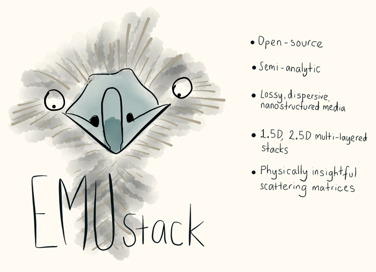

.. EMUstack documentation master file, created by
   sphinx-quickstart on Sat Jun 14 14:17:22 2014.
   You can adapt this file completely to your liking, but it should at least
   contain the root `toctree` directive.

EMUstack documentation
======================

.. rst-class:: lead

    Version |version|, last updated on |today|

EMUstack is an open-source simulation package for calculating light propagation through multi-layered stacks of dispersive, lossy, nanostructured, optical media. It implements a generalised scattering matrix method, which extends the physical intuition of thin film optics to complex structures.

.. toctree::
    :maxdepth: 4
    :hidden:

    intro
    install
    tutorial
    python_backend
    fortran_backend
    examples/index

==================
Indices and tables
==================

* :ref:`genindex`
* :ref:`modindex`
* :ref:`search`

